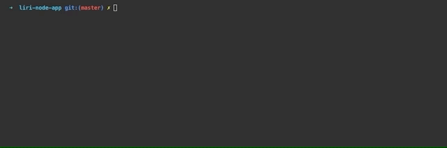

# liri-node-app

## Description
LIRI is like iPhone's SIRI. However, while SIRI is a Speech Interpretation and Recognition Interface, LIRI is a Language Interpretation and Recognition Interface. LIRI will be a command line node app that takes in parameters and gives you back data.

### How to Use
Use the following commands when running `node liri.js`:
  * `concert-this` `<artist/band name here>`
    * This utilizes the [axios](https://www.npmjs.com/package/axios) NPM package to search the Bands in Town Artist Events API for an artist and render the following information about each event to the terminal
      * Artist Name
      * Venue Name
      * Venue City
      * Venue Region
      * Event Date
  * `spotify-this-song` `<song name here>`
    * This utilizes the [node-spotify-api](https://www.npmjs.com/package/node-spotify-api) NPM package to retrieve information about songs from the Spotify API and render the following information about the song in the terminal
      * Song Name
      * Artist Name
      * Preview Url
      * Album Name
      * If no song is provided then it will default to 'Bohemian Rhapsody' by Queen
  * `movie-this` `<movie name here>`
    * This utilizes the [axios](https://www.npmjs.com/package/axios) NPM package to retrieve data from the OMDB API for a Movie title and render the following information about the movie to the terminal
      * Movie Name
      * IMDB Rating
      * Rotten Tomatoes Rating
      * The Country
      * The Language
      * The Plot
      * The Actors
      * If the user doesn't type a movie in, the program will output data for the movie 'The Boondock Saints'
  * `do-what-it-says`
    * This utilizes the Node.js [fs](https://nodejs.org/api/fs.html) module to read the contents of the `random.txt` file and trigger one of the above commands based on the contents of the file. Works with all three commands
      * spotify-this-song,"We are the champions"
      * concert-this,"Ozzy Osbourne"
      * movie-this,"Fight Club"

### APIs Used
#### Spotify
https://developer.spotify.com/dashboard/

* The Spotify API requires you sign up as a developer to generate the necessary credentials. You can follow these steps in order to generate a **client id** and **client secret**:
   * Step One: Visit <https://developer.spotify.com/my-applications/#!/>
   * Step Two: Either login to your existing Spotify account or create a new one (a free account is fine) and log in.
   * Step Three: Once logged in, navigate to <https://developer.spotify.com/my-applications/#!/applications/create> to register a new application to be used with the Spotify API. You can fill in whatever you'd like for these fields. When finished, click the "complete" button.
   * Step Four: On the next screen, scroll down to where you see your client id and client secret. Copy these values down somewhere, you'll need them to use the Spotify API and the [node-spotify-api package](https://www.npmjs.com/package/node-spotify-api).

#### OMDB
http://www.omdbapi.com/

* The OMDB API requires an email for the free API Key
  * To request a key visit: http://www.omdbapi.com/apikey.aspx

#### Bands In Town
http://www.artists.bandsintown.com/bandsintown-api

* The Bands In Town API requires you to have an API Key
  * To request a Key visit: http://www.artists.bandsintown.com/bandsintown-api

### Languages Used

  * JavaScript
  * jQuery
  * Bootstrap 4
  * CSS 3
  * HTML 5

### Node Packages Used
#### axios
https://www.npmjs.com/package/axios

#### dotenv
https://www.npmjs.com/package/dotenv

#### moment
https://www.npmjs.com/package/moment

#### node-spotify-api
https://www.npmjs.com/package/node-spotify-api

#### standard
https://www.npmjs.com/package/standard

Installed as `devDependencies` and hooked into `"scripts": { "test":`
